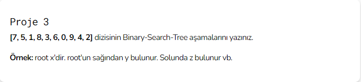
***
1. Root 7 'dir.
***
2. 5, 7 'den küçük olduğu için sola geçer. 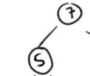
***
3. 1, 7 'den küçük olduğu için sola geçer, 5 'den de küçük olduğu için 5 'in soluna yazılır. 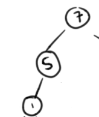
***
4. 8, 7 'den büyük olduğu için sağa geçer. 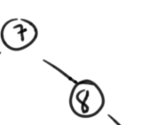
***
5. 3, 7 'den küçük olduğu için sola geçer, 5 'den de küçük olduğu için sola geçer, 1 'den de büyük olduğu için sağa geçer. 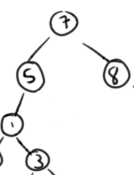
***
6. 6, 7 'den küçük olduğu için sola geçer, 5 'den büyük olduğu için 5 'in sağına yazılır. 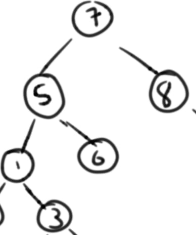
***
7. 0, 7 'den küçük olduğu için sola geçer, 5 'den küçük olduğu için sola geçer. 1 'den de küçük olduğu için 1'in soluna yazılır. 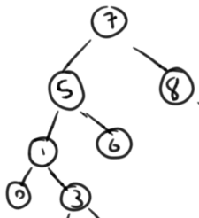
***
8. 9, 7 'den büyük olduğu için sağa geçer, 8 'den de büyük olduğu için 8 'in sağına yazılır. 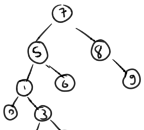
***
9. 4, 7 'den küçük olduğu için sola geçer, 5 'den küçük olduğu için sola geçer, 1 'den büyük olduğu için sağa geçer, 3 'den de büyük olduğu için 3 'ün sağına yazılır. 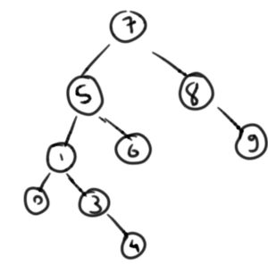
***
10. 2, 7 'den küçük olduğu için sola geçer, 5 'den küçük olduğu için sola geçer, 1 'den büyük olduğu için sağa geçer, 3 'den de küçük olduğu için 3 'ün soluna yazılır. 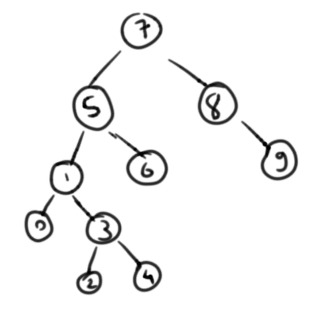

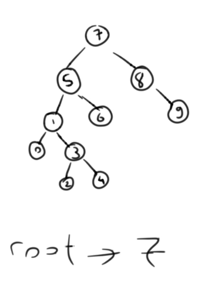